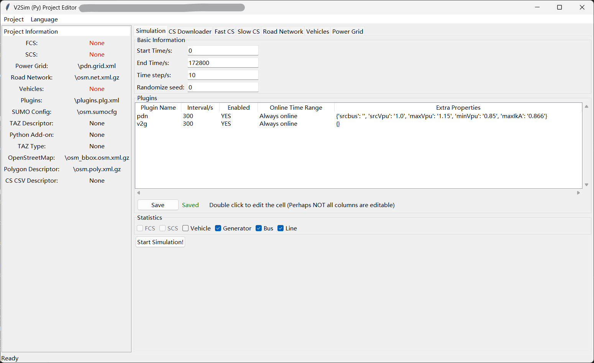
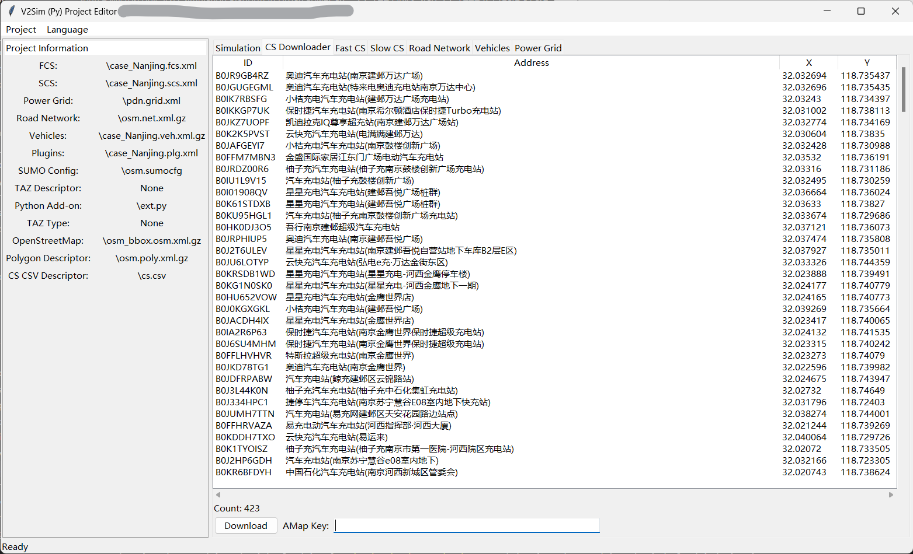
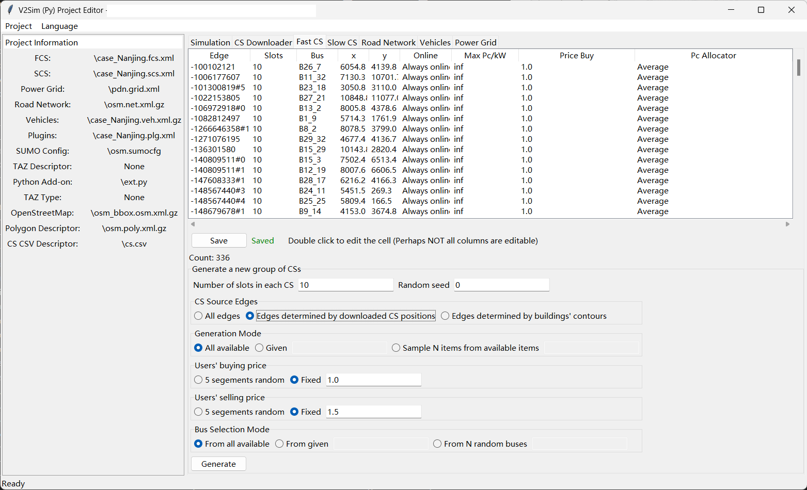
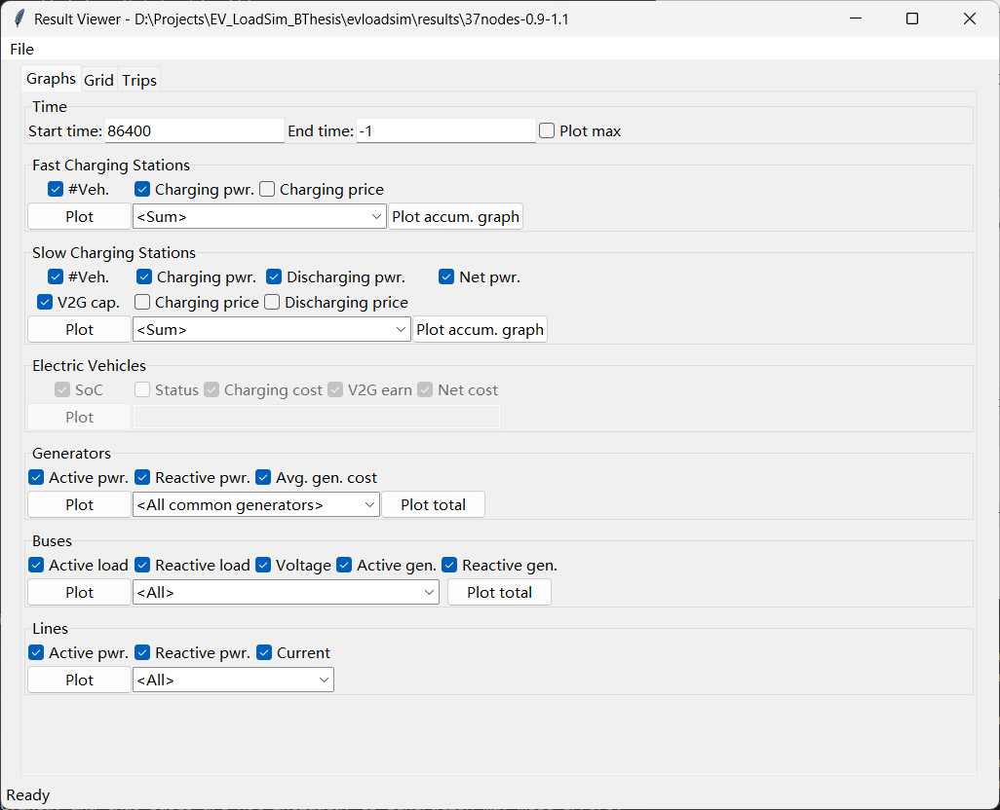
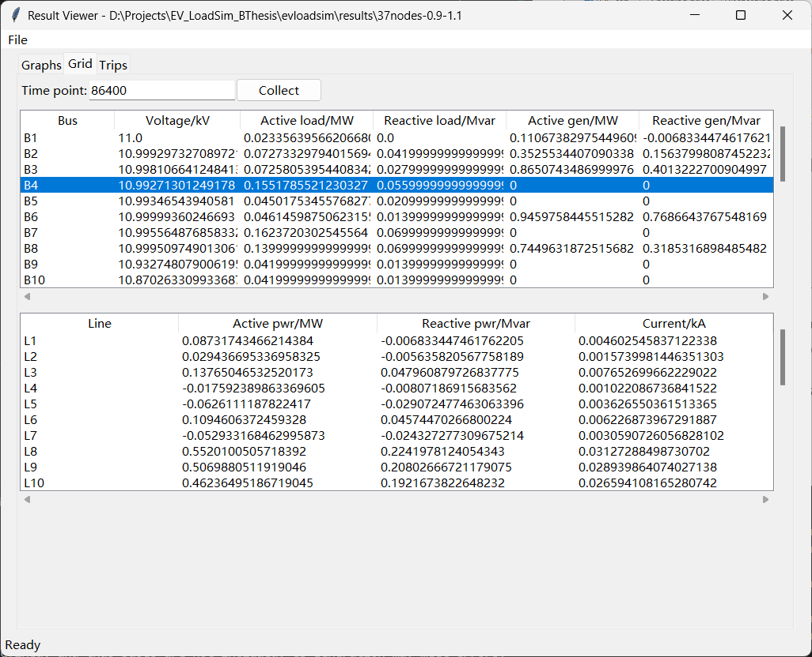
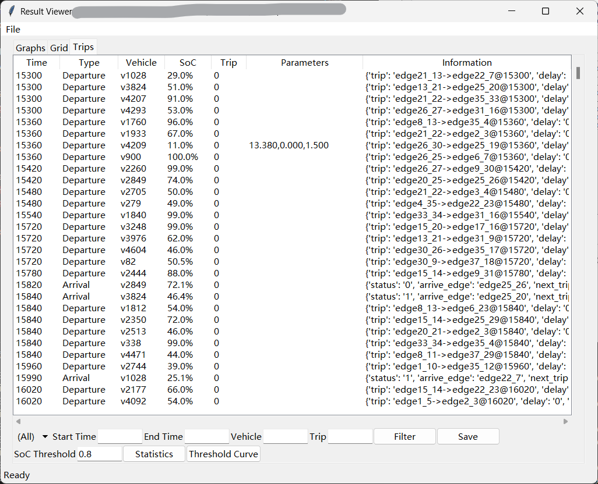

# V2Sim: An Open-Source Microscopic V2G Simulation Platform in Urban Power and Transportation Network

Paper on arXiv: https://arxiv.org/abs/2412.09808

[Click here to read the Wiki](https://github.com/fmy-xfk/v2sim/wiki) 

V2Sim is a microscopic V2G simulation platform in urban power and transportation network. It is open-source under BSD license.

## Quick Start

### A. Setup the environment

1. Setup Python: Visit `https://www.python.org/download` to get Python (version 3.12 or above recommended).

2. Setup SUMO: Visit `https://eclipse.dev/sumo/` to get the newest version of SUMO.

3. Setup necessary packages. Ensure you have installed `pip` together with Python.
```bash
pip install -r requirements.txt
```

4. Download this repo. You can directly download this repo by clicking the `download` button on this page. Or you can setup `git` and clone this repo by the following command. The official tutorial about using `git` is [here](https://git-scm.com/book/en/v2/Getting-Started-Installing-Git).
```bash
git clone https://github.com/fmy-xfk/v2sim.git
```

### B. Create a case
There are 3 pre-defined cases in the `cases` folder. You can exploit the 3 cases directly, or create a new case from scratch.

The following is a full tutorial for creating a case:

1. Download transportation network: Use the OSMWebWizard provided by SUMO to download the road network. 

|Do NOT add vehicles|Only preserve 'highway'|
|---|---|
|||

Copy your case generated with OSMWebWizard to a proper place. Then run `gui_main.py` in the command prompt by:
```bash
python gui_main.py
```
* **Notice:** Double click to open this file is **NOT** recommended since many users have reported it doesn't work as expected.

Click the `Project` menu and open the folder you have created. You will see something like this:



2. Download charging station positions: If the area you downloaded is in **China Mainland**, you can download charging station positions in this program. Otherwise, please skip this step.
+ Switch to `CS Downloader` page and type an AMap developer key in the given input box. **ATTENTION: You must apply for a key on the [AMap official site](https://lbs.amap.com/)! This function will never work without a key!** 
+ Click `Download` to get CS positions from AMap(高德地图). Please wait patiently while downloading the CS positions. If there are too many CSs in the given area, they may not be all downloaded due to the restriction of AMap.
+ A successful result is shown below (The address are all Chinese since they are located in China):



+ After download the CS positions, please close the project editor and reopen it to avoid any potential error in the editor.

3. Generate charging stations: Switch to `Fast CS` and `Slow CS` respectively to generate differnt types of charging stations. We strongly recommend you to generate CS from the downloaded positions if you are using a real-world road network. Click the `Generate` button to generate CS.

+ Do **NOT** click `Generate` repeatedly even if it seems not working. The progress will be shown in the command prompt instead of popping up another window.

+ A successful result is like this:



4. **Generate vehicles**: Switch to `Vehicles` page to generate vehicles. We strongly recommend you to generate trips from the buildings' contours and types if you are using a real-world road network. 

+ Do **NOT** click `Generate` repeatedly even if it seems not working. The progress will be shown in the command prompt instead of popping up another window.

5. **Start simulation**: Make sure the `FCS`, `SCS`,` Road Network`, and `Vehicles` are not `None` in the left column. Then go back to `Simulation` page, tick your desired statistic items, and click `Start Simulation!`.


### C. Simulation
The window will shut down once you clicked `Start Simulation!`. Please wait patiently during simulation. It may cost several hours when simulate a large real-world network. You can watch the progress and estimated time required displayed in the command prompt.

### D. Plotting
After the simulation is done, run `gui_viewer.py` and open the result just produced. The results is in `results` folder, with the same name as your case name. It will be something like this:



Some items may not be available becasuse the corresponding statistic item is not selected when configuring the project. 

Click buttons containing `Plot` to draw figures. Figures of results will be stored in `results\<case_name>\figures`.

You can also collect the data of the power grid at a specific time in page `Grid`. Enter the time point and then click `Collect`.



Trips are also counted in `Trips` page. You can filter them by giving the conditions in the bar attached to the bottom of the window. You can also save the filtered results to a specific file.

